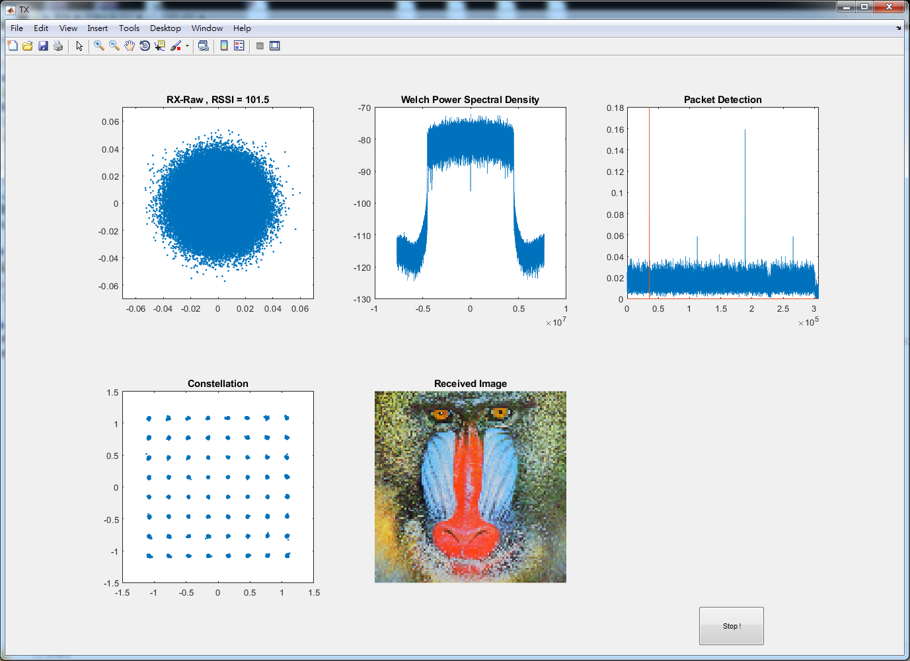

# SDR_Matlab_LTE
This simple OFDM demo is based on LTE downlink format for testing SDR hardware.

Using Software Designed Radio (SDR) to transmit OFDM signals at 2.4 GHz.

Transmitter and Receiver hardware : Zedboard (Xilinx Zynq®-7000) + AD9361 (Analog Device-FMCOMMS3)


# Software needed :

* Matlab (R2018a version in this example)
* [Zynq Linux Image](https://wiki.analog.com/resources/tools-software/linux-software/zynq_images) (2015_R2-2016_07_26 version in this example)

# Code Structure :
Please open Matlab windows to run
* `Main_self.m` for one transceiver
* `Main_TwoBoard.m` for transmitter and receiver

# GUI_RX

Video Demo : https://youtu.be/jywNhMAHi7Y

## TX RX Hardware Parameters
| Center Frequency                 | 2.4 GHz                          |
|:--------------------------------:|:--------------------------------:|
| Bandwidth                        | 10 MHz                           |
| Sampling Rate                    | 15.36 MS/s                       |
| Mapping                          | 64 QAM                           |
| FFT Size                         | 1024                             |
| Cyclic Prefix Length             | 512                              |
| Resource Block                   | 50                               |
| Samples Per Frame                | 307200                           |
| PC Host IP address               | 192.168.3.1                      |
| TX IP address                    | 192.168.3.6                      |
| RX IP address                    | 192.168.3.7                      |

# Hardware shut down process
To shut down the hardware properly, execute the commands below.

Enter Linux by ssh
```
ssh analog@192.168.3.X
```
Default password :
```
analog
```
Shutdown command :
```
sudo shutdown -h now
```
